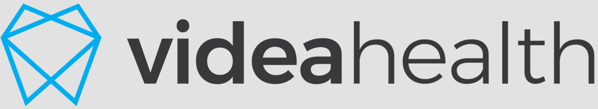
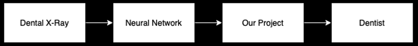
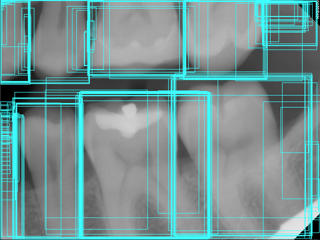
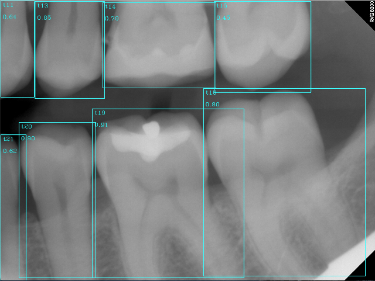
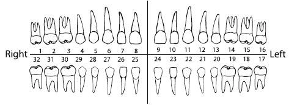

[VideaHealth](https://www.videa.ai/) is a Boston-based startup that brings AI to the field of dentistry by automating the process of dental x-ray analysis. Today, denticians have to spend countless hours analyzing these images and they still miss up to 50% of pathologies in dental x-rays. VideaHealth is helping dentists identify diseases and communicate treatment recommendations to their patients.

#### How to use:
1. Install the dependencies 
<code>pip install -r requirements.txt</code>

2. Run the main file 
<code>python main.py</code>

3. To see the visualizer, add the command line argument -V or --visualize 
(Press 0 on your keyboard to cycle through the images) 
<code>python main.py -V</code>

### Project Description

Group members: Tony Chau, Jeffrey Garcia, Cameron Hayes, Ke Liu, Paul Maynard, Danley Nemorin, Suncharn Pipithkul, and Jacob Janak.

We worked on VideaHealth's neural network as part of our CS 410 Intro to Software Engineering class in the Spring of 2021. The existing neural network they created was already outputting lots of predictions. Our job was to refine these predictions into a single result. This is how our project fits into VideaHealth's system:

This is what the raw data that we were getting from the neural network looks like on a dental x-ray:

In the above image, you can see that there are far too many boxes for the number of teeth. The nueral network is outputting every possible box that it can think of. Although this is not shown in the image, every box has a predicted tooth label and a probability score. We used these boxes and their respective labels and scores to trim the output down to one box per tooth. This is what the results look like after our postprocessing algorithm is run:

You can see that each tooth now only has one box. It also has a label and a confidence score. We used a non-maximum suppression algorithm to correctly output the boxes. Non-maximum suppression is a common technique to filter the predictions of object detectors. We also wrote a seperate algorithm to assign the correct numbers to each tooth. We had to work around edge cases for people with missing teeth or other irregularities. This chart shows how teeth should be numbered:

Our results were good, achieving both a precision, recall, and f1 of about 0.93. We calculated this number using an IOU threshold of 0.7, meaning that we consider an outputted box to be good if it is at least 70% overlapping with the tooth (as per the clients request). Precision is defined by the number of good boxes divided by the number of total outputted boxes. Precision shows how trustworthy each of our outputted boxes are. Recall is defined by the number of good boxes divided by the number of good boxes plus the number of missed boxes. Recall shows how many boxes are missing in our output. The goal of object detection is to balance precision and recall to get the best results. We were able to calculate these numbers by comparing our results to the ground truth data. The ground truth was determined by an actual dentist. The fact that our results were so close to the dentist's results is promising.

<b>NOTE:</b> We are not allowed to share all the x-ray data that we used because it is confidential medical information. We are only able to share a small sample from that data set.
